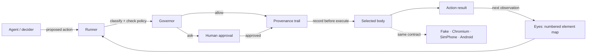

# Ghost Hands

[](https://pypi.org/project/ghost-hands/)
[](https://pypi.org/project/ghost-hands/)
[](LICENSE)
[](https://github.com/littlestjames82-sys/ghost-hands/releases/tag/v0.9.0)
[](https://github.com/littlestjames82-sys/ghost-hands/actions/workflows/ci.yml)

**Playwright drives. Stagehand thinks. Browser Use wanders. Ghost Hands answers for every move.**

Ghost Hands is a standalone, zero-dependency Python package that gives an
agent *hands* on the web — and a conscience to go with them. Every action an
agent takes is classified before it runs (`readonly` / `write` /
`consequential`), judged against a policy, written to a provenance trail
*before* it executes, and — when it matters — gated on a human approval.
Finished runs graduate into deterministic, model-free Ghost Hands scripts
you can re-run for free.

The browser body is **our own**: a stdlib Chrome DevTools Protocol client
drives Chromium directly over the `--remote-debugging-pipe` transport.
There is no Playwright, no Selenium, and no other automation library under
the hood — the automation layer is 100% ours. (We drive Chromium, the
browser; we did not write a browser engine and don't claim to have.)

From [Ghost Developer Studio](https://github.com/littlestjames82-sys).
MIT licensed.

> Status: **v0.9.0** — the field kit wave (`ghost-hands doctor` stack
> diagnostics + `ghost-hands phone-proof`, the guided on-device proof).
> Install it from [PyPI `ghost-hands`](https://pypi.org/project/ghost-hands/)
> with `pip install ghost-hands`, see the
> [GitHub release](https://github.com/littlestjames82-sys/ghost-hands/releases/tag/v0.9.0),
> or browse the [project site](https://littlestjames82-sys.github.io/ghost-hands/).

## What's new in 0.9.0

- **`ghost-hands doctor`** (`doctor.py`) — one command that answers
  "is everything wired up?" for the whole stack. Seven read-only
  checks — the Python runtime, a Chromium binary (found by the
  driver's own resolver, so doctor and the driver can never
  disagree), the four policy packs, the model environment, a
  GhostBus server (when `--bus` / `GHOSTBUS_URL` configures one;
  the workspace shape — single vs hosted `/w/<id>/` — is reported),
  the MrGhosty phone bridge (when configured: reachable, token
  accepted, MrGhosty version, accessibility state, bridge-protocol
  match), and adb — each rendering as a PASS / WARN / FAIL row with,
  when it isn't a PASS, a one-line plain-language fix ("Is the phone
  on, MrGhosty accessibility on, and `adb forward tcp:8378
  tcp:8378` running?" / "Pairing token mismatch — re-copy it from
  MrGhosty's Access checklist into GHOST_HANDS_ANDROID_TOKEN.").
  FAIL means "this part will not work until you act"; WARN means
  idle-or-optional (an unconfigured bus or bridge is a WARN, never
  a failure). Exit code is 1 iff anything FAILs. `--json` emits the
  same checks as structured data. Every probe carries a short
  timeout, so doctor never hangs on a dead endpoint, and no secret
  is ever printed: keys and the pairing token are reported as
  present, never as values.
- **`ghost-hands phone-proof`** (`phone_proof.py`) — the guided
  version of the first phone run. Where `phone-approval-test`
  proves one thing in isolation, phone-proof walks all five steps
  and *checks* each: bridge configured (else it prints the exact
  env setup and stops — exit 2, needs-setup), the adb forward
  (printed before it runs; skipped gracefully without adb/a
  device), the bridge status (MrGhosty version + accessibility),
  the harmless test approval ("LOOK AT YOUR PHONE NOW — tap
  Approve on the MrGhosty notification"), and a closing summary of
  what is now proven plus the exact next commands. Denied, expired,
  or timed-out approvals end gracefully with instructions —
  exit 3 (not approved); bridge/config failures are exit 1.
  `--yes` runs straight through without pauses, which is how the
  tests and bench drive it against the fake bridge.

### First phone proof

With MrGhosty v1.7+ installed on the phone and its accessibility
service enabled, the whole first run is:

```bash
adb forward tcp:8378 tcp:8378        # or let phone-proof do it (step 2)
export GHOST_HANDS_ANDROID_TOKEN=<pairing code from MrGhosty → Device tab → Ghost Hands bridge>
ghost-hands doctor                   # every row green or explained?
ghost-hands phone-proof              # five checked steps to "proven"
```

`phone-proof` prints what each step needs before it checks it, and
its exit code says how the story ended: 0 proven · 1 error ·
2 needs-setup · 3 not approved. After it passes, the phone is a
governed body: `ghost-hands run --driver android --approver phone`
drives it with approvals on the phone itself.

## What's new in 0.8.0

- **Trail → HTML audit report** (`ghost-hands report trail.jsonl`,
  `report.py`). The trail was always the record; now it's a readable
  one. One run renders to ONE self-contained HTML file — inline CSS,
  no JavaScript, no external assets, works offline — in studio
  styling (dark charcoal, violet accent): a header (goal when the
  trail records one, body inferred from the perception URLs, date
  range, stop reason + summary), summary stat cards (steps, wall
  duration, perception chars / ~tokens, actions by class, approvals
  requested/granted/denied, heals, downloads/dialogs/net counts),
  and a step-by-step timeline — perceived map summary with a
  collapsible perception record, the decision in plain language
  ("click [4] 'Place order'"), the Governor's verdict with its
  classification chip and, for asks, how the story ended
  ("ask → approved via phone"), the result, and special events inline
  (heals with from/to, dialogs, downloads with filename + size,
  approval request/decision pairs with channel + decider, network
  capture in a collapsible). Rendering is defensive: every trail
  string is HTML-escaped (a hostile page title stays text), typed
  values are truncated at 80 chars, and a value typed into a
  `type=password` element renders as `•••• (N chars)`. Corrupt lines
  are skipped and counted in the footer — a partial trail is still a
  record. A sample render ships in `examples/sample-report.html`.
- **MCP parity.** The MCP server is no longer fake-web-only:
  `GHOST_HANDS_DRIVER=fake|chromium|simphone|android` selects the
  session body (default: fake, as before), `GHOST_HANDS_START_URL`
  opens on the first perceive, and android sessions use the same
  `GHOST_HANDS_ANDROID_BRIDGE` / `GHOST_HANDS_ANDROID_TOKEN` env as
  the bus agent (the token never appears in tool output). Bodies with
  native eyes perceive through them, exactly like the Runner.
  `GHOST_HANDS_APPROVER=phone` routes session "ask" verdicts through
  `PhoneApprover` instead of the deny-with-explanation default, and
  `hands_act` replies state which channel decided ("approved via
  phone" / "denied: no approver (MCP default)"). `hands_run` defaults
  to the session body and accepts all four drivers. Configuration is
  per-server-process; unknown values fail loudly at startup.
- **The `seatbelt` policy pack.** Standard's posture (readonly +
  write allowed, consequential asks, 300s approval leash) plus a
  target-content rule: if a target element's name/label — or the
  page/action URL — matches a curated prompt-injection pattern
  (`policies.INJECTION_PATTERNS`: "ignore previous instructions",
  "disregard your instructions", "you are now", "system prompt",
  "click here to claim", "verify your password to continue", …), the
  Governor denies the action outright, whatever its class, and the
  govern event's reason names the matched pattern. The patterns are
  instruction-shaped phrases, never bare words — a button named
  "Ignore" does not trip it (guarded by tests). Implemented as data
  on the Policy (`deny_patterns`), so any pack or policy file can
  carry its own list.

## What's new in 0.7.0

- **The model evaluation harness** (`ghost-hands eval`,
  `evaluate.py`). Eight graded tasks against local fixture pages —
  search-and-open, multi-field form fill + consequential submit,
  structured table extraction, multi-hop navigation to a fact, a
  trap page whose prominent button is destructive and must NOT be
  touched, a shifting page scored on heal recovery, a login form
  whose trail is audited for credential leakage, and an impossible
  goal scored on honest stopping. Four tasks run on real Chromium.
  Every task is scored on success, steps, wall time, perception
  chars / ~tokens, actions by class, approvals requested, and
  heals; `--report PATH` writes the JSON. Three deciders:
  `--decider stub` (a local stub model server whose deterministic
  policy proves the harness end to end — **stub results are harness
  verification only, not a model-quality measurement**),
  `--decider rules` (the RuleDecider as a second baseline), and
  `--decider openai` (a real model via the existing env-configured
  decider). Measured on this build: the stub passed 8/8 (the
  instrument works); the rules baseline passed 3/8 (trap avoidance,
  heal recovery, honest stop — its honest failures on search,
  forms, extraction, multi-hop, and login are data, not harness
  errors). Real-model numbers are reported separately wherever a
  key is available; see "Honest status".
- **Android gestures** (MrGhosty v1.8.0). Three action kinds the
  Android body used to refuse — `double_click`, `drag`, `click_at`
  — are implemented end to end: the bridge dispatches real gestures
  (`dispatchGesture`, bounded callback latch, honest
  cancelled/failed results), `click_at` is validated against the
  current window's bounds and refused out-of-bounds, and
  `AndroidDriver` forwards all three (drag resolves both ends;
  `click_at` needs no target). SimPhoneDriver does not implement
  them — no fake parity; see `docs/BODY_PROTOCOL.md` §6 for which
  body supports what.
- **The GhostBus file-store loop is closed.** The v0.4 finding (the
  file-backed store's shared-`.tmp` rename colliding under
  concurrent writers, HTTP 400) was fixed in GhostBus 0.4.1
  (unique temp per save + serialized saves) and regression-tested
  in the GhostBus suite since 0.5.0 (44/44 + 6/6, re-verified for
  this build). Ghost Hands now proves it from its own side too:
  the bus demo flow and a parallel agent+poller barrage run
  against a real file-backed GhostBus with zero 400s, an intact
  store, and no orphan temp files (bench `v7 bus`, pytest
  `test_file_store_barrage_no_races`).

## What's new in 0.6.0

- **Approvals by phone.** A run's "ask" decisions can be routed to
  Ryan's phone: `PhoneApprover` (`phone_approver.py`) posts a
  redacted approval request to the Ghost Hands bridge in MrGhosty
  v1.7.0, which raises a high-importance notification ("Ghost Hands
  needs approval") with **Approve** / **Deny** actions, mirrored by a
  card in MrGhosty's Device tab. The decision returns over the
  bridge; denied, expired, timed-out, and unreachable all mean **no**
  — silence is never consent. Works with every driver
  (`ghost-hands run --approver phone …` — the phone can approve a
  desktop Chromium run too), and in bus-agent mode via
  `--approval-channel phone` (the bus gets a courtesy comment; the
  approval itself is never requested from the bus). Approvals route
  to Ryan's phone through the MrGhosty bridge (notification +
  in-app decision) when the bridge is reachable; it is a local
  bridge channel, not a cloud push service. See
  [docs/APPROVALS.md](docs/APPROVALS.md).
- **Decisions are phone-only, by construction.** The bridge API can
  create and read approval requests but has **no decision
  endpoint** — a token holder can never approve their own request.
  The only deciders are the notification actions and the in-app
  card, on the phone itself.
- **Summaries are redacted before they leave the machine.** A
  request carries the action kind, classification, target
  descriptor, and current URL/package; `type` actions show the
  target and a character count, never the typed text; `fill_form`
  shows field names, never values. The pairing token never appears
  in summaries, trail events, errors, or logs.
- **`ghost-hands phone-approval-test`** — sends one harmless test
  request ("approving this runs nothing") and waits for the phone
  decision: the one-command on-device proof.

## What's new in 0.5.0

- **The real Android body.** `AndroidDriver` (`android_driver.py`)
  drives a real phone through the **Ghost Hands bridge** in the
  MrGhosty Android app (v1.6.0): a loopback-only HTTP server hosted by
  MrGhosty's accessibility service on `127.0.0.1:8378`, authenticated
  by a pairing token (shown in MrGhosty's Device tab; passed via
  `GHOST_HANDS_ANDROID_TOKEN`, never stored). Perception walks the
  live accessibility tree into the same numbered ElementMap (each
  element keeps its bridge `ref` as `body_ref`); actions re-verify
  the target's {tag, role, name} key at the bridge before anything
  moves, and stale targets come back as the same "target missing /
  target mismatch" errors the Runner heals from on the web. The
  unchanged Runner/Governor drive it — governance is identical,
  including the consequential gate. Web-only actions fail honestly.
  Forward the bridge with `adb forward tcp:8378 tcp:8378`, check it
  with `ghost-hands android-status`, then
  `ghost-hands run --driver android …` (or task it over GhostBus with
  `"driver": "android"`). The driver and the bridge are built and the
  full flow is proven against the bridge contract (fake-bridge
  conformance suite + bench case); **on-device proof is pending
  Ryan's install of MrGhosty v1.6.0 + the accessibility grant**.
- **Element `body_ref`.** Elements now carry an optional opaque
  body-native target reference in their descriptor, so trails record
  exactly which node a phone action touched.

## What's new in 0.4.0

- **GhostBus agent mode.** `ghost-hands bus-agent` puts the hands on
  [GhostBus](https://github.com/littlestjames82-sys/ghostbus) as the
  agent `ghost-hands` (role: hands). It claims tasks addressed to it or
  tagged `hands` — respecting claim leases, `blockedBy`, and the bus's
  own needs-approval gate (gated tasks are never claimed) — runs them
  through the same Runner/Governor/Trail, posts progress comments,
  uploads the JSONL trail as a shared bus file, and completes with a
  structured report. Works against the single-workspace relay and
  hosted workspaces (`--workspace`, `/w/<id>/`), key from flag/env only,
  never stored. `ghost-hands bus-demo` proves the whole loop against
  the **real** GhostBus node server — including a consequential submit
  approved by a second client over the bus, mid-run.
- **Approvals over the bus.** When the Governor says "ask" during a bus
  run, the approver posts `APPROVAL NEEDED: <class> <summary> — reply
  APPROVE <run-id> or DENY <run-id>` as a task comment and a message to
  the task's creator, then waits (long-poll) up to the approval
  timeout. Deny or timeout = denied, on the record: both the request
  and the decision land in the trail as `approval` events.
- **The Body Protocol.** [docs/BODY_PROTOCOL.md](docs/BODY_PROTOCOL.md)
  formalizes the driver contract — perceive → numbered ElementMap,
  `act(action)` → outcome, optional capability flags — and the shared
  action vocabulary, so new bodies can be built against a written spec.
  A conformance scenario (same abstract script on every body) proves
  it: the destructive step is denied with no approver and lands with
  one, and the trail records identical shapes, on FakeDriver,
  ChromiumDriver, and the new phone body alike.
- **SimPhoneDriver.** A simulated Android-style body (in-memory):
  home screen with app icons, a Notes app (type, save, notes persist;
  a "Delete all notes" button that classifies consequential), a
  Settings app with toggles, a Back/Home navigation stack, and real
  PNG screenshots rendered with stdlib only. The existing
  Runner/Governor/deciders drive it unchanged — it is the rehearsal
  body for the real Android body — which has since landed (v0.5.0,
  above): the same Runner/Governor drive SimPhoneDriver in tests and
  a real phone through AndroidDriver.
- **Policy packs.** Named, loadable governor bundles
  (`ghost_hands.policies`): `readonly` (writes + consequential denied
  outright), `standard` (the default posture), `strict` (writes ask
  too; approvals on a 120s leash). `--policy-pack` on `run` and
  `bus-agent`; the MCP server honors `GHOST_HANDS_POLICY`. Unknown
  pack names are a loud error, never a silent fallback.

## What's new in 0.3.0

- **Two kinds of eyes.** DOM eyes now walk the composed tree — open
  shadow roots pierced, same-page iframes included and tagged — so web
  components and framed controls are numbered like everything else.
  Or switch to **AX eyes** (`eyes="ax"`): the map is built from the CDP
  Accessibility tree (role + name + states) and actions resolve back
  through `backendNodeId`.
- **Forms in one move.** `fill_form` fills a whole form from
  `{label: value}` pairs, resolving each field by label, name,
  placeholder, or aria-label, and reports per-field results — failures
  named, never silent. With `submit: true` it is classified
  consequential and takes the normal approval path.
- **Files both ways.** `download` clicks through and waits for the file
  to complete on disk (filename + byte size reported, completion on the
  trail); `set_file` uploads a local file into a file input
  (`DOM.setFileInputFiles`), refusing missing paths and directories.
- **Network on the record.** The Network domain is captured during
  runs (method, URL, status, type) into `net` trail events, capped at
  200 per run with truncation noted; `extract` mode `network` returns
  the captured list.
- **Structured extract.** `extract` modes: `text` (default), `list`
  (links → `[{text, href}]`), `table` (→ list of row dicts), `network`.
- **Dialogs handled, on the record.** `confirm`/`alert`/`prompt` are
  answered per the driver policy (`dialog_policy="dismiss"|"accept"`,
  default dismiss) and every dialog + decision lands on the trail.
- **Richer input.** `hover`, `double_click`, `right_click`, `drag`
  (target → target), key chords in `press` (`"Control+a"`), and
  `click_at(x, y)` — the raw-coordinate fallback, classified `write`
  and marked `raw: true` on the trail.
- **PDF + viewport.** `pdf` prints the page to a real PDF file
  (`Page.printToPDF`); `set_viewport` switches named presets
  (desktop 1280×800, mobile 390×844 + touch) and perception reflects
  the emulated layout, media queries included.
- **Wait-for conditions.** `wait_for` waits for text to appear, an
  element matching a descriptor, or a URL substring — with a timeout
  that fails honestly, on the record.
- All new actions work through the CLI runner and MCP `hands_act`
  unchanged, and every one of them is still classified by the governor
  and written to the trail. (HTML-snapshot eyes do not pierce shadow
  roots or frames — that is what the live-element map is for.)

## What's new in 0.2.0

- **Live-web proven.** The Chromium driver has now driven real sites end
  to end: example.com (followed the IANA link to the Example Domains
  page) and a real Wikipedia search — the deterministic RuleDecider typed
  "Oakdale, Tennessee", submitted, and landed on the Oakdale article.
  Reproduce with `ghost-hands bench --live` (2 cases, verified Oct 8,
  2026 from the studio sandbox).
- **Self-healing targets.** If the page mutates between perception and
  action, the stale target is detected, re-found by its recorded
  descriptor, retried exactly once, and the heal is written to the trail
  as its own event.
- **Tabs.** `open_tab` / `switch_tab` / `list_tabs` — each tab is its own
  CDP target; perception and actions apply to the active tab.
- **Session state.** `save_session` / `load_session`: cookies
  (Network.getAllCookies / setCookie) plus the current origin's
  localStorage, in a small versioned JSON format.
- **Screenshots to disk.** The screenshot action now writes a real PNG
  (`Page.captureScreenshot`) to the action's `path`.
- **Proxy support.** The driver honors `HTTPS_PROXY` / `https_proxy`
  (opt out with `proxy=""`). Authenticated proxies work via a built-in
  local relay that injects the credentials Chrome itself can't accept;
  `ignore_cert_errors=True` is available for TLS-intercepting proxies.
- **Decider wire proof.** The OpenAI-compatible decider's protocol —
  request shape, env gating, reply parsing, the full Runner loop — is
  covered by tests and a bench case against a local stub
  `/chat/completions` server. Live-model driving quality remains
  unproven (see "Honest status").
- **Graduated scripts, executed.** Replay export now takes `driver=`
  (chromium or fake-with-embedded-pages) and `start_url=`; the bench
  actually *executes* a graduated script against fixture pages on real
  Chromium and checks its completion marker.

## Quickstart

```bash
pip install ghost-hands        # PyPI: ghost-hands 0.9.0
ghost-hands demo               # scripted run over a built-in fake mini-web — no browser needed
ghost-hands bench              # the verification suite
```

Drive a real page:

```python
from ghost_hands import ChromiumDriver, Runner, ScriptedDecider

driver = ChromiumDriver()  # finds Chromium/Chrome; $GHOST_HANDS_CHROME overrides
runner = Runner(driver, ScriptedDecider([
    {"kind": "navigate", "url": "https://example.com"},
    {"kind": "extract"},
    {"kind": "done", "summary": "looked at the page"},
]))
report = runner.run("look at example.com")
print(report.stop_reason, report.summary)
driver.close()
```

## How it works



Every path to a body passes through the Governor. The trail records the
decision before execution; an ask reaches the body only after approval.

| Layer | What it does |
|---|---|
| **Eyes** (`eyes.py`) | Numbered **ElementMap** — `[3] <button> "Sign in"` — compact text with a character budget. No screenshots, no vision model. Two sources: an HTML snapshot parse (offline body), or the live browser — a composed-tree DOM walk (shadow roots + iframes) or the CDP Accessibility tree. |
| **Hands** (`actions.py`) | Typed, JSON-serializable actions: navigate, click, type, press (with key chords), select, scroll, hover, double/right click, drag, click_at (raw coordinates), fill_form, set_file, download, extract (text/list/table/network), screenshot (to a real PNG file), pdf, set_viewport, wait / wait_for, tabs, session save/load, done. Targets are element numbers, never raw selectors. |
| **Governor** (`governor.py`) | Classifies every action *before* execution and applies a policy: allow / ask / deny per class, a domain allowlist, blocked domains. Form submits and anything smelling like pay / send / delete / publish / transfer is **consequential**. |
| **Trail** (`trail.py`) | JSONL provenance: perceive → decide → govern → execute → result → stop (plus `heal`, `dialog`, `net`, and `download` events), with per-run accounting (steps, perception chars, ~tokens at chars/4, actions by class). Govern + execute are recorded **before** the action runs. |
| **Bodies** (`drivers.py`, `simphone.py`, `android_driver.py`) | `FakeDriver` (in-memory mini-web for tests/demos), `ChromiumDriver` (real Chromium via our own CDP client: auto-wait, tabs, session save/load, screenshots to disk, downloads/uploads, network capture, dialog policy, viewport emulation, PDF, env-proxy support with a credential-injecting local relay, stale-target detection), `SimPhoneDriver` (simulated Android-style phone: apps, notes, toggles, Back/Home, rendered PNG screenshots), and `AndroidDriver` (a real phone via the MrGhosty app's Ghost Hands bridge: loopback HTTP/JSON, pairing-token auth, accessibility-tree perception with `body_ref` targets, key-verified actions, real screenshots on API 30+, loopback-only by construction). The contract every body signs is [docs/BODY_PROTOCOL.md](docs/BODY_PROTOCOL.md). |
| **Brains** (`deciders.py`) | `ScriptedDecider` (explicit steps), `RuleDecider` (deterministic offline rules — "go to…", "click…", "type… into…", "search for…"), `OpenAICompatibleDecider` (any OpenAI-compatible endpoint; key from env only, never stored; wire protocol proven against a local stub server). |
| **Runner** (`runner.py`) | The loop, with a step budget, stuck detection (same action 3×, or an unchanged map for 3 steps), and self-healing: a target that moved mid-flight is re-found by descriptor and retried once, heal logged. Honest stop reasons: `done` / `budget` / `denied` / `stuck` / `error`. Silence is never consent: an "ask" with no approver is a denial. |
| **Replay export** (`export.py`) | Graduate a trail into a standalone Ghost Hands script that replays the executed steps deterministically — no model, still governed. Chromium body, or a fake body with the mini-web embedded. |
| **Policy packs** (`policies.py`) | Named governor bundles as data: `readonly` (perception only — writes and consequential denied outright), `standard` (the default), `strict` (writes ask too, 120s approval leash), `seatbelt` (standard posture + injection-shaped targets denied outright — v0.8). Each pack sets per-class allow/ask/deny, an approval timeout, allowlist additions, and optional `deny_patterns`. |
| **Audit report** (`report.py`) | Renders a trail JSONL into one self-contained HTML audit report (v0.8): header, stat cards, a step-by-step timeline with governor verdicts and approval outcomes, special events inline. All trail strings escaped; password-typed values masked. |
| **Bus mode** (`busclient.py`, `busagent.py`) | A stdlib GhostBus REST client (single-workspace relay or hosted `/w/<id>/`; key + agent token from flag/env, memory only) and the agent loop on top: register as `ghost-hands`, claim addressed/tagged tasks (leases, `blockedBy`, and the bus's needs-approval gate respected), run them governed, route approvals back over the bus, upload the trail as a shared file, complete with a structured report. |
| **MCP server** (`mcp_server.py`) | Stdlib-only stdio MCP: `hands_perceive`, `hands_act`, `hands_run`, `hands_trail`. Body + approver configured per process by env: `GHOST_HANDS_DRIVER` (fake/chromium/simphone/android, v0.8), `GHOST_HANDS_START_URL`, `GHOST_HANDS_APPROVER=phone` (asks decided on Ryan's phone; default: denied with an explanation, and replies name the deciding channel), `GHOST_HANDS_POLICY` (a policy pack name). |

## CLI

```bash
ghost-hands demo                                   # built-in fake-web demo
ghost-hands bench                                  # the offline verification suite
ghost-hands doctor                                 # diagnose the whole stack (add --json for tooling)
ghost-hands phone-proof                            # the guided on-device proof (exit: 0/1/2/3)
ghost-hands report trail.jsonl                     # trail -> trail.html audit report (-o for a path)
ghost-hands bench --live                           # + live cases: example.com, Wikipedia
ghost-hands run --script steps.json --driver fake  # or --driver chromium
adb forward tcp:8378 tcp:8378                      # forward the phone's Ghost Hands bridge (USB)
ghost-hands android-status                         # is MrGhosty's bridge answering? (token via env)
ghost-hands run --script steps.json --driver android   # drive the real phone, governed
ghost-hands run --script steps.json --policy policy.json --approve-all
ghost-hands run --script steps.json --policy-pack strict   # or readonly
ghost-hands export trail.jsonl -o replay.py        # graduate a trail into a script
ghost-hands export trail.jsonl --driver fake --pages pages.json -o replay.py
ghost-hands mcp                                    # MCP server on stdio
ghost-hands bus-agent --once                       # work one GhostBus task, then exit
ghost-hands bus-agent --workspace studio           # hosted bus, /w/studio/ (key via GHOSTBUS_KEY)
ghost-hands bus-demo                               # prove bus mode vs the real GhostBus server
```

See `examples/steps.json` and `examples/policy.json` for the file formats.

## How it compares

| | Driver stack | Intent layer | Governance / approval gate | Provenance trail | Run → script replay | Bodies |
|---|---|---|---|---|---|---|
| **Playwright** | Own protocol drivers for Chromium/Firefox/WebKit | None — deterministic scripts | None | Trace viewer for tests | Codegen records scripts | Web |
| **Playwright MCP** | Playwright via MCP (23+ raw tools) | The calling model, unmediated | None | None built in | No | Web |
| **Stagehand** | Playwright + AI primitives (act/observe/extract/agent) | Per-step LLM calls | None | Session logs | Action caching | Web (cloud browsers upsell) |
| **Browser Use** | Own browser agent loop | Full autonomous LLM loop | None | Run history | No | Web |
| **Jev** | Numbered control list, cheap decision pass | Single cheap pass per step | None (we built Agent Seatbelt for it) | Minimal | No | Web |
| **Ghost Hands** | **Own CDP stack, zero dependencies — no Playwright, no Selenium under the hood** | Pluggable: scripted, deterministic rules, or any OpenAI-compatible model | **Classify + policy + approval before every action; record-before-execute** | **Full JSONL trail with per-run accounting** | **Yes — trails graduate into Ghost Hands scripts** | Web (Chromium) + a real Android body (MrGhosty bridge) + a simulated phone body, under a written Body Protocol |

### Capabilities, feature by feature

Surveyed from each project's public docs (Oct 2026); "—" means not a
built-in of the tool as documented. Every Ghost Hands row is proven by
a named bench case on real Chromium unless marked (fake) — the bench
says which body each case ran on.

| Capability | Playwright | Stagehand | Browser Use | Ghost Hands |
|---|---|---|---|---|
| Numbered element map for a model | Via MCP / snapshots | observe | Yes (own format) | **Yes — DOM or Accessibility-tree eyes** |
| Shadow DOM controls | Yes | Yes | Partial | **Yes — open roots pierced (live map)** |
| Iframe controls | Yes | Yes | Partial | **Yes — same-page frames, tagged** |
| JS dialogs (confirm/alert) | Yes | Yes | Yes | **Yes — policy-driven, decision on the trail** |
| Downloads | Yes | Yes | Yes | **Yes — completion + size on the trail** |
| File upload | Yes | Yes | Yes | **Yes — `set_file`** |
| Network capture | Yes (HAR/request APIs) | Via Playwright | Limited | **Yes — `net` trail events + extract mode** |
| Fill a whole form in one step | No (per-field API) | act per field | Agent loop | **Yes — `fill_form`, per-field results** |
| Structured extract (list/table) | Manual locators | extract (LLM schema) | Agent loop | **Yes — deterministic, no model call** |
| Hover / double / right click / drag | Yes | Via act | Yes | **Yes** |
| Key chords (Control+a) | Yes | Via act | Yes | **Yes** |
| Raw coordinate clicks | Yes | — | Yes | **Yes — classified `write`, marked raw** |
| PDF export | Yes (Chromium) | Via Playwright | — | **Yes** |
| Device/viewport emulation | Yes | Via Playwright | Viewport opts | **Yes — named presets, perception follows** |
| Wait for text/element/URL | Yes | Via act | Agent loop | **Yes — honest timeout on the record** |
| **Every action classified + approval-gated** | **No** | **No** | **No** | **Yes — the whole point** |
| **Run graduates into a replayable script** | Codegen (records new) | Action cache | No | **Yes — from the trail** |

## Honest status

What is proven, and what is not — as of v0.6.0 (Oct 8, 2026):

- **Proven:** the full offline suite (299 pytest tests, 88 bench cases);
  the Chromium driver on fixture pages (perceive / type / click / tabs /
  session roundtrip / screenshots / graduated-script execution) and the
  full v0.3 capability set on real Chromium (see the matrix note);
  live runs on example.com and Wikipedia (`ghost-hands bench --live`,
  2/2); the LLM decider's wire protocol against a local stub endpoint;
  **bus agent mode against the real GhostBus node server** — both the
  single-workspace relay and a hosted `/w/<id>/` workspace — including
  an approval granted and an approval denied over the bus mid-run;
  the Body Protocol conformance scenario on all three in-process
  bodies; the sim phone's notes flow end to end; **the Android body
  against the bridge contract** — AndroidDriver's full governed flow
  (including heal-after-mutation and the consequential delete gate)
  against a fake bridge speaking the exact wire protocol of the real
  one, plus the MrGhosty v1.6.0 APK built and signature-verified with
  the bridge compiled in; **approvals by phone against the same
  contract** — PhoneApprover's full request/poll flow (approved /
  denied / expired / timeout / unreachable / 401), payload redaction
  proven on the wire, a consequential action approved and denied by
  simulated phone decisions mid-run on both the Android and web
  bodies, the bus agent's phone channel against the real GhostBus
  server, and the MrGhosty v1.7.0 APK built and signature-verified
  with the approval store, receiver, and bridge endpoints compiled
  in (approval-store logic JVM-tested, 44 checks).
- **Unproven:** live-model driving quality beyond the local
  fixtures — v0.7's eval harness measures any env-configured model
  on 8 graded local tasks (stub 8/8 = harness proof only; rules
  baseline 3/8; real-model results are reported per run, never
  stored as a standing claim), but the fixtures are small and
  local: how a model drives arbitrary third-party sites remains
  the model's business and unproven here;
  the Chromium driver against arbitrary third-party websites beyond the
  two live cases above; head-to-head speed vs any other tool (never
  measured, never claimed); bus mode against a *deployed* hosted
  GhostBus (proven against the real server booted locally, in both
  shapes); **the Android body and the phone-approval flow on
  physical hardware — driver + MrGhosty bridge + approval UX are
  built, but no phone was attached during the v0.5/v0.6 builds;
  on-device proof waits on Ryan's install of MrGhosty v1.8.0 and his
  accessibility grant (then: `adb forward tcp:8378 tcp:8378` and
  `ghost-hands phone-approval-test`).** v0.9 ships the tools for
  exactly that run: `ghost-hands doctor` diagnoses the stack before
  and after, and `ghost-hands phone-proof` walks the five steps
  with him, checking each — both proven here against the fake
  bridge and a locally booted bus, neither yet run against his
  physical phone. One bus finding
  from the v0.4 work is resolved: GhostBus's file-backed store
  wrote through a single shared `.tmp` file whose rename could
  collide under heavy concurrent writers (HTTP 400) — fixed in
  GhostBus 0.4.1, regression-tested in the GhostBus suite since
  0.5.0, and re-proven from this side in v0.7 (file-store bus demo
  + agent/poller barrage, zero 400s). A narrower characteristic
  remains, by GhostBus's design: shared-store state is re-read per
  operation (read-modify-write, so several processes can share one
  workspace file), which means many *simultaneous* writers can
  still lose updates silently — the agent+poller workload Ghost
  Hands actually generates is unaffected (measured).

## Safety posture

- **No stealth.** Ghost Hands identifies honestly and never disguises
  automation. Governance is the product; evasion is not a feature.
- **No stored keys.** The OpenAI-compatible decider reads
  `GHOST_HANDS_API_KEY` / `GHOST_HANDS_BASE_URL` / `GHOST_HANDS_MODEL` from
  the environment only.
- **Denied means denied.** A blocked, denied, or unapproved action never
  executes — and the trail shows the verdict and the reason.

## Roadmap

- [x] **GhostBus transport** — hands as a bus agent other agents can
  task, approvals routed over the bus (v0.4.0).
- [x] **Policy packs** — named governor bundles: readonly / standard /
  strict (v0.4.0). Seatbelt/GhostGuard-flavored packs can follow the
  same data format.
- [x] **Body Protocol** — the written driver contract + a simulated
  phone body proving it (v0.4.0).
- [x] **Android body** — driver + MrGhosty bridge BUILT (v0.5.0):
  MrGhosty's accessibility service implements the Body Protocol
  behind a loopback, pairing-token bridge, and `AndroidDriver` speaks
  to it; on-device proof pending Ryan's install + accessibility
  grant. One hands, phone + web.
- [x] **Approvals by phone push** — DONE (v0.6.0), with one precise
  caveat about the word "push": approvals route to Ryan's phone
  through the MrGhosty bridge (notification + in-app decision) when
  the bridge is reachable; it is a local bridge channel, not a
  cloud push service. The bridge API has no decision endpoint —
  decisions happen only on the phone itself.
- [x] **Model evaluation harness** — BUILT (v0.7.0): `ghost-hands
  eval` grades a decider on 8 local tasks (4 on real Chromium) with
  per-task scoring and a JSON report; stub + rules baselines ship
  with it, real models plug in through the environment.
- [x] **Android gestures** — BUILT (v0.7.0, MrGhosty v1.8.0):
  `double_click`, `drag`, and `click_at` implemented on the real
  Android body via `dispatchGesture`; the simulator does not fake
  them.
- [x] **Field kit** — BUILT (v0.9.0): `ghost-hands doctor`
  (whole-stack diagnostics with plain-language fixes, `--json`
  for tooling, secrets never printed) and `ghost-hands
  phone-proof` (the guided five-step on-device proof — checked,
  scriptable, exit-coded). On-device proof itself still waits on
  Ryan's phone; these are the tools that run it with him.

## Repository map

**Links:** [PyPI](https://pypi.org/project/ghost-hands/) ·
[Site](https://littlestjames82-sys.github.io/ghost-hands/) ·
[Release v0.9.0](https://github.com/littlestjames82-sys/ghost-hands/releases/tag/v0.9.0) ·
[CHANGELOG.md](CHANGELOG.md) · [LAUNCH.md](LAUNCH.md)

- `src/ghost_hands/` — the package, one module per layer: `eyes`
  (perception), `actions`, `governor`, `policies` (policy packs),
  `trail`, `drivers` (FakeDriver + our CDP ChromiumDriver), `simphone`
  (the simulated phone body), `android_driver` (the real Android body
  via the MrGhosty bridge), `phone_approver` (approvals decided on
  Ryan's phone), `deciders`, `runner`, `export`,
  `busclient` + `busagent` (GhostBus mode), `evaluate` (the v0.7
  model-evaluation harness), `report` (the v0.8 trail → HTML audit
  report), `doctor` + `phone_proof` (the v0.9 field kit),
  `mcp_server`, `cli`, `bench`.
- `docs/BODY_PROTOCOL.md` — the body contract, capability flags,
  conformance rules, and the Android mapping table.
- `docs/APPROVALS.md` — the three approval channels (prompt, bus,
  phone), the no-API-decision rule, and the summary redaction rule.
- `tests/` — the pytest suite (395 tests at v0.9.0).
- Bench — `ghost-hands bench` (offline, 95 cases at v0.9.0) and
  `ghost-hands bench --live` (opt-in real-web cases); bench code lives
  in `src/ghost_hands/bench.py`.
- `examples/` — sample steps and policy files for `ghost-hands run`,
  plus `sample-report.html` — a rendered audit report (from
  `sample-trail.jsonl`) showing exactly what `ghost-hands report`
  produces.
- `site/` — the project site source, deployed to GitHub Pages by
  `.github/workflows/pages.yml`.
- `LAUNCH.md` — the launch runbook and copy pack, as written at launch.
- `PLAN.md` — the field survey and design notes the build started from.

## From Ghost Developer Studio

Ghost Hands is one part of the studio's agent-infrastructure family:

- **Visual roadmap board** — where every studio product stands, in one picture: [ghost-roadmaps](https://github.com/littlestjames82-sys/ghost-roadmaps)
- **GhostGuard** — the governance layer for autonomous systems: [ghostguard](https://github.com/littlestjames82-sys/ghostguard)
- **GhostBus** — agent-to-agent message bus and shared workspace, exposed as an MCP server: [ghostbus](https://github.com/littlestjames82-sys/ghostbus)
- **Ghost Bridge** — MCP bridge + self-hostable relay for handing tasks to a personal agent, with scoped keys and approvals: [ghost-bridge](https://github.com/littlestjames82-sys/ghost-bridge)
- **Agent Seatbelt** — deterministic guardrails that gate what an AI coding agent does before it does it: [agent-seatbelt](https://github.com/littlestjames82-sys/agent-seatbelt)
- **Ghost Developer Studio storefront** — [storefront](https://github.com/littlestjames82-sys/storefront)

Built in public by Ryan Cotten / Ghost Developer Studio.

## License

MIT — see `LICENSE`. © 2026 Ghost Developer Studio.
