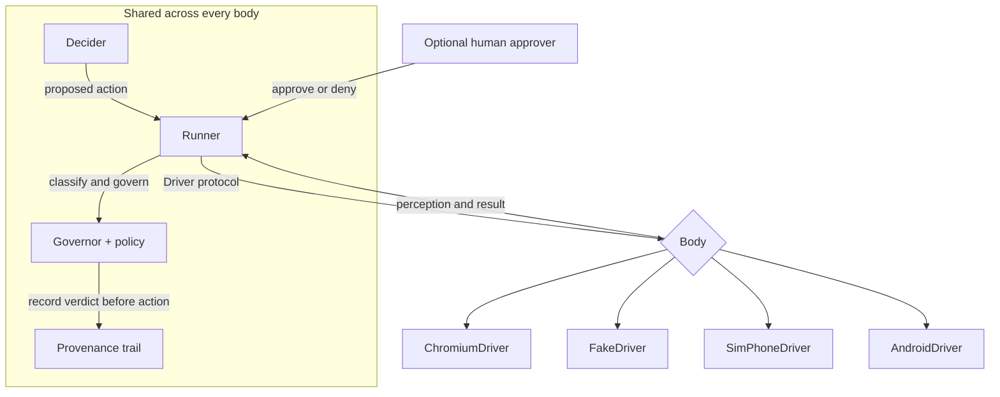

# The Ghost Hands Body Protocol

**Status:** v0.5.0 — contract defined, proven by three bodies (four
drivers). The Android body is **built**: `AndroidDriver` speaks this
protocol to the Ghost Hands bridge inside MrGhosty v1.6.0 on the
phone (§6). Its conformance is proven over the real transport against
a fake bridge implementing the identical wire contract; proof on
physical hardware is pending Ryan's install of MrGhosty v1.6.0 plus
his accessibility grant.

Ghost Hands is one pair of hands with swappable *bodies*. The brain
(decider), the conscience (governor), and the memory (trail) never
change between bodies — only the body does. This protocol is the
contract every body signs.

## 1. The contract

The body supplies perception and performs an action only after the shared
Runner and Governor have handled it. Swapping bodies does not swap the
brain, policy, approval gate, or trail.

A body is any object implementing the **Driver protocol**
(`ghost_hands.drivers.Driver`):

| Method | Contract |
|---|---|
| `open(url)` | Bring the body to a starting surface (a web URL, or a body-specific locator like `phone://home`). |
| `snapshot_html()` | Return an HTML rendering of the current surface, parseable by `ElementMap.from_html`. Bodies with richer native perception implement `perceive()` instead (below). |
| `current_url()` | A stable locator string for the current surface (`https://…`, `phone://notes`, …). Recorded on every perceive event. |
| `act(action, element)` | Perform ONE action (see §3) against the element the Runner resolved from the current map. Return a short human-readable result string. Raise `HandsError` — never fake success — for anything the body cannot do. |
| `close()` | Release the body. Safe to call more than once. |

Optional, discovered by the Runner at runtime:

| Member | Contract |
|---|---|
| `perceive()` | Return an `ElementMap` built from the body's native perception (ChromiumDriver: DOM/AX trees; SimPhoneDriver: its screen model). When present, the Runner prefers it over `snapshot_html()`. |
| `event_sink` | A settable callable `(event_type, fields)`. The Runner wires it so body-originated events (`dialog`, `net`, `download`) land in the run's trail under the current step. |
| `capabilities` | A dict of capability flags (§4). |
| Body-specific extras | e.g. ChromiumDriver's `open_tab` / `switch_tab` / `save_session` / `load_session`. Extras are *not* protocol: the Runner never requires them, and the shared action vocabulary never names them. |

## 2. Perception: the ElementMap

`perceive` (either method) yields an **ElementMap**: a list of
`Element`s numbered **1..N, gapless, in a stable order**, each with:

- `tag`, `role`, `name` — the element's identity. The triple
  `(tag, role, name)` is the element's *key*: it is recorded in the
  trail at execute time, and it is how the Runner **self-heals** — if
  an action fails with a `target mismatch` / `target missing` error,
  the Runner re-perceives, re-finds the element *by key*, records a
  `heal` event, and retries exactly once. Bodies that can detect
  staleness should raise those exact error shapes.
- Optional descriptors: `type`, `href`, `id`, `attr_name`,
  `placeholder`, `value`, `label`, `form_action`, `frame`,
  `backend_id`, and `body_ref` — an opaque body-native target
  reference (v0.5: the Android bridge's child-index path, e.g.
  `"0/2/1"`) that the body uses to resolve the element at act time.
  The Governor reads these (a `type=submit` target or a
  consequential keyword in the name makes a click **consequential**),
  so bodies must fill them honestly.

Perception is text-only by design: no screenshots feed decisions, so a
perception costs ~hundreds of tokens, not thousands. `signature()`
feeds the Runner's stuck detection; a body whose surface changed must
produce a different signature.

## 3. The shared action vocabulary

Actions are the typed `Action` values in `ghost_hands.actions` —
targets are **element numbers from the current map, never raw
selectors**, so every decision stays auditable. Bodies must support
the *core* set or fail honestly per action:

- **Core (every body):** `navigate`, `click` (= tap on a phone),
  `type`, `press` (keys/chords; on a phone: `Back`, `Home`),
  `scroll`, `extract`, `screenshot`, `wait` / `wait_for`, `done`
  (decider-side; never reaches `act`).
- **Web-shaped (bodies opt in):** `select`, `hover`, `double_click`,
  `right_click`, `drag`, `click_at`, `fill_form`, `set_file`,
  `download`, `pdf`, `set_viewport`.

The Governor classifies every action before the body moves:
`readonly` (perceive/move-only), `write` (ordinary reversible change),
`consequential` (submits; money/messaging/deletion/publishing smells).
**Bodies never classify** — classification is the Governor's, from the
action + target element + page URL, identical across bodies.

## 4. Capability flags

`capabilities` is a plain dict; absent flags mean `False`.

| Flag | Meaning | Chromium | Fake | SimPhone | Android |
|---|---|---|---|---|---|
| `perceive` | native `perceive()` beyond HTML snapshot | ✓ (DOM/AX) | — (HTML) | ✓ | ✓ (a11y tree) |
| `screenshot` | `screenshot` returns a real image (PNG) | ✓ | — (message only) | ✓ (rendered PNG) | ✓ (API 30+; flag follows status) |
| `tabs` | multiple surfaces via body extras | ✓ | — | — | — |
| `session` | session save/load extras | ✓ | — | — | — |
| `viewport` | `set_viewport` supported | ✓ | ✓ (nominal) | — | — |
| `pdf` | `pdf` supported | ✓ | — (message only) | — | — |
| `network_capture` | `net` trail events emitted | ✓ | partial (load log) | — | — |
| `android` | the body is a real Android phone via the bridge | — | — | — | ✓ |

## 5. Conformance

A body conforms when the shared scenario passes against it
(`tests/test_conformance.py`, and the two-body bench case):

1. Perception yields a gapless 1..N numbered map.
2. Through the unchanged Runner + Governor: readonly/write actions
   execute; a consequential action is **denied** with no approver
   (and nothing is destroyed), and **executes** with one.
3. The trail records the same shapes in protocol order —
   `perceive → decide → govern → execute → result` per step, govern
   events carrying `classification` + `outcome` — whatever the body.

Proven at v0.4.0 for: **ChromiumDriver** (real Chromium, fixture over
HTTP), **FakeDriver** (in-memory web), **SimPhoneDriver** (in-memory
phone). The scenario in all three is the same abstract script: open
Notes, new note, type "hello ghost", save, attempt delete-all.

At v0.5.0 the same scenario also passes for **AndroidDriver**
(`tests/test_android_e2e.py`), over real HTTP against a fake bridge
(`tests/fake_android_bridge.py`) implementing the identical wire
contract as the phone-side bridge — including a heal-after-mutation
run, where the screen changes between perception and action and the
bridge's 409 drives the Runner's descriptor heal. Running the
scenario against the physical bridge in MrGhosty on Ryan's phone is
the remaining proof, and it needs his install + accessibility grant.

## 6. The Android body (built, v0.5.0)

MrGhosty's Android accessibility service implements this contract as
the fourth body. The phone half is the **Ghost Hands bridge**
(`GhostHandsBridge` in MrGhosty v1.6.0): an HTTP/1.1 server bound to
127.0.0.1:8378 only, started when the accessibility service connects.
Every endpoint requires the pairing token (generated on the phone,
shown only in MrGhosty's Device tab) as `X-Ghost-Hands-Token`; the
bridge obeys authenticated local Ghost Hands requests only — model
text never reaches it, and on the client side every action still
passes the Governor first. The computer half is `AndroidDriver`,
reached over `adb forward tcp:8378 tcp:8378` (or on-device).

Wire contract:

- `GET /v1/status` → `{ok, protocol: 1, app: "MrGhosty", version,
  service_connected, foreground_package, api_level}`
- `POST /v1/perceive` → `{ok, url: "android://<package>", package,
  elements}` — each element `{ref, tag, role, name, id?, value?,
  bounds, attrs}`; `ref` is the child-index path from the window root
  and is carried on the Element as `body_ref`.
- `POST /v1/act` → `{action, target_ref, expected: {tag, role,
  name}}`. The bridge re-walks the live tree, resolves the ref, and
  verifies the key before touching anything: vanished target → HTTP
  404 `target missing: ...`; changed target → HTTP 409 `target
  mismatch: ...` — the exact shapes §2's healing keys on.

The mapping, as implemented:

| Protocol action | Android accessibility implementation |
|---|---|
| `perceive()` | Walk `AccessibilityNodeInfo` tree of the active window; visible interactive nodes (`clickable`, `long-clickable`, `editable`, `focusable`, scrollable, `checkable`) become elements (cap 300, truncation noted); `role` from `className` (Button/ImageButton→`button`, EditText→`text_field`, Switch→`toggle`, CheckBox→`checkbox`, RadioButton→`radio`, SeekBar→`slider`, Spinner→`combobox`, TextView→`button` if clickable else `text`), `name` from `text` / `contentDescription` / hint / view-id tail. |
| `click` (tap) | `ACTION_CLICK` on the node when it is clickable; otherwise `dispatchGesture` tap at the node's bounds center. Honest failure when neither works. |
| `type` | `ACTION_SET_TEXT` on the editable node (focus first with `ACTION_FOCUS` if needed). |
| `press Back/Home/Recents/Notifications/QuickSettings` | The matching `GLOBAL_ACTION_*` via `performGlobalAction`; other keys are honestly unsupported. |
| `scroll` | `ACTION_SCROLL_FORWARD` / `BACKWARD` on the target node, else the first scrollable node (up/left = backward, down/right = forward). |
| `extract` | Concatenate visible node texts of the active window (capped). |
| `screenshot` | `AccessibilityService.takeScreenshot()` (API 30+), PNG-encoded, base64 on the wire; honest error below API 30. |
| `navigate` | Launch intent for `app://<package>` (or `android://<package>`), `ACTION_VIEW` for http/https; other schemes honestly refused. |
| `wait` / `wait_for` | Timed locally by the driver; conditions poll bridge perception until they hold or the timeout expires (honest error). |
| `double_click` (v1.8.0) | Two `dispatchGesture` taps at the target's bounds center in one gesture description (second stroke starts ~180ms after the first, ~120ms between tap starts' ends), after the same ref resolution + expected verification as `click`. The async gesture callback is awaited on a bounded latch (2s): completed → result; cancelled or timed out → honest HTTP 400. |
| `drag` (v1.8.0) | The act body carries `to_ref` + `to_expected` for the destination; BOTH ends are resolved and verified (same 404/409 shapes). One `dispatchGesture` stroke from the source's bounds center to the destination's bounds center over ~300ms, awaited on the bounded latch; cancelled/timed out → honest HTTP 400. |
| `click_at` (v1.8.0) | Coordinates come from the action (`x`, `y`); no target is required. The bridge reads the active window root's screen bounds and refuses out-of-bounds points honestly (HTTP 400 naming the point and the bounds); in-bounds taps dispatch a single gesture tap, awaited like the others. |

Web-shaped actions (`select`, `hover`, `right_click`, `fill_form`,
`set_file`, `download`, `pdf`, `set_viewport`) are refused honestly
by the driver — the phone body has no honest equivalent for them.
(`double_click`, `drag`, and `click_at` joined the implemented set
in MrGhosty v1.8.0; the *simulated* phone body — SimPhoneDriver —
does not implement them and still refuses them honestly: no fake
parity.)

Android realities the contract already anticipates: node trees mutate
constantly (hence heal-by-key, §2), some surfaces are canvas-drawn
with empty trees (hence honest perception failures — the driver
reports an empty map, never an invented one), and the accessibility
service is granted by the user on the phone — declaring the capability
is not having it, which is why capability flags exist (§4).

## 7. Adding a body

1. Implement the five protocol methods (§1); add `perceive()` /
   `capabilities` if the body has native perception.
2. Map the core vocabulary (§3); raise `HandsError` for the rest.
3. Detect staleness and raise `target mismatch` / `target missing`
   so the Runner can heal.
4. Run the conformance scenario (§5) against your body. If it passes,
   the hands fit.
